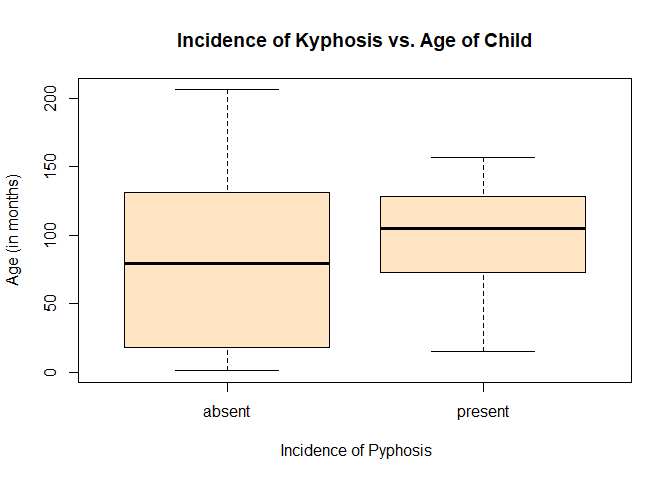
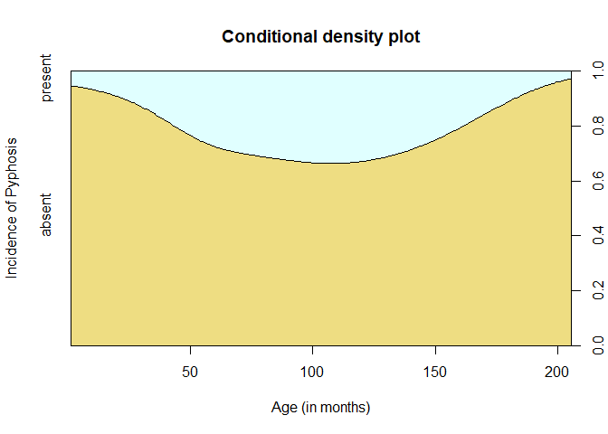

Logistic Regression Model Comparison
================
Pandula Priyadarshana
December 15, 2018

This project aims to provide a simple illustration on how we can develop different logistic regression models by considering subsets of predictor variables and then compare these models against each other to decide the best.

For the modelling purposes, I will be using a dataset containing information about a spinal deformity called *Kyphosis*. Kyphosis is found in young children who have undergone corrective spinal surgery and the incidence of spinal deformities following corrective spinal surgery is thought to be related to the Age (in months) at the time of surgery, Start (the starting vertebra for the surgery) and Num (the number of vertebrae involved in the surgery).

Keeping above information in mind, let's first import the dataset and explore it's composition and structure.

``` r
kyphosis <- read.csv("C:/Users/PandulaP/Documents/GitHub/personal-projects/Logistic Regression Model Comparison/kyphosis.r", sep="")

head(kyphosis)
```

    ##   Kyphosis Age Number Start
    ## 1   absent  71      3     5
    ## 2   absent 158      3    14
    ## 3  present 128      4     5
    ## 4   absent   2      5     1
    ## 5   absent   1      4    15
    ## 6   absent   1      2    16

``` r
str(kyphosis)
```

    ## 'data.frame':    81 obs. of  4 variables:
    ##  $ Kyphosis: Factor w/ 2 levels "absent","present": 1 1 2 1 1 1 1 1 1 2 ...
    ##  $ Age     : int  71 158 128 2 1 1 61 37 113 59 ...
    ##  $ Number  : int  3 3 4 5 4 2 2 3 2 6 ...
    ##  $ Start   : int  5 14 5 1 15 16 17 16 16 12 ...

As it's seen above, the response is a binary variable and the predictor variables are of integer type.

Now let's plot the response variable against `age` data. Here I use a box-plot and a conditional density plot to illustrate the data points.

``` r
boxplot(Age ~ Kyphosis,data = kyphosis, 
        col = "bisque",
        xlab = " Incidence of Pyphosis",
        ylab = "Age (in months)",
        main = "Incidence of Kyphosis vs. Age of Child")
```



``` r
cdplot(Kyphosis~Age, kyphosis,
       col=c("lightgoldenrod", "lightcyan"), 
       ylab = "Incidence of Pyphosis", xlab ="Age (in months)", main = "Conditional density plot")
```



By observing the box-plot, we can understand that, the age distribution for `absent` is more wide spread than of the `present` incidences. Thus, even though we can assume to expect a difference in `age` variable for the two levels of response variable, at the same time, its observable that the `present` incidences and the `absent` incidences overlap on the same `age` range.

Furthermore, by looking at the 'Conditional density plot', we can see that, age towards the two extremes (i.e., lower-end and higher-end) results with higher `absent` incidence whereas the probability of observing a `present` incidence is high around the 60 to 140 months age range (but still less than 40%)

Now given that our response variable is of binary type, we first fit a `simple logistic regression` model for the incindence of Kyphosis against 'age':

``` r
model_1 <- glm(Kyphosis~Age,data = kyphosis, family = binomial(link="logit"))

summary(model_1)
```

    ## 
    ## Call:
    ## glm(formula = Kyphosis ~ Age, family = binomial(link = "logit"), 
    ##     data = kyphosis)
    ## 
    ## Deviance Residuals: 
    ##     Min       1Q   Median       3Q      Max  
    ## -0.9023  -0.7397  -0.6028  -0.5521   1.9449  
    ## 
    ## Coefficients:
    ##              Estimate Std. Error z value Pr(>|z|)    
    ## (Intercept) -1.809351   0.530353  -3.412 0.000646 ***
    ## Age          0.005442   0.004822   1.129 0.259068    
    ## ---
    ## Signif. codes:  0 '***' 0.001 '**' 0.01 '*' 0.05 '.' 0.1 ' ' 1
    ## 
    ## (Dispersion parameter for binomial family taken to be 1)
    ## 
    ##     Null deviance: 83.234  on 80  degrees of freedom
    ## Residual deviance: 81.932  on 79  degrees of freedom
    ## AIC: 85.932
    ## 
    ## Number of Fisher Scoring iterations: 4

By observing the results of the fitted model, we can see that, the `age` variable itself does not account to result with a good model. It's p-value is high and therefore does not appear to be of any significance to the model which only includes the intercept.

Now, in oder to see if by adding the `quadratic` term of the `age` variable would result with a significance, I include it to another model and fit the second model for the data.

``` r
model_2 <- glm(Kyphosis~ Age + I(Age^2),
               data = kyphosis,
               family = binomial(link="logit"))

summary(model_2)
```

    ## 
    ## Call:
    ## glm(formula = Kyphosis ~ Age + I(Age^2), family = binomial(link = "logit"), 
    ##     data = kyphosis)
    ## 
    ## Deviance Residuals: 
    ##     Min       1Q   Median       3Q      Max  
    ## -1.0079  -0.8412  -0.4155  -0.2209   2.3920  
    ## 
    ## Coefficients:
    ##               Estimate Std. Error z value Pr(>|z|)   
    ## (Intercept) -3.7702901  1.1511211  -3.275  0.00106 **
    ## Age          0.0700351  0.0269840   2.595  0.00945 **
    ## I(Age^2)    -0.0003652  0.0001478  -2.471  0.01349 * 
    ## ---
    ## Signif. codes:  0 '***' 0.001 '**' 0.01 '*' 0.05 '.' 0.1 ' ' 1
    ## 
    ## (Dispersion parameter for binomial family taken to be 1)
    ## 
    ##     Null deviance: 83.234  on 80  degrees of freedom
    ## Residual deviance: 72.739  on 78  degrees of freedom
    ## AIC: 78.739
    ## 
    ## Number of Fisher Scoring iterations: 5

Now as it's observed, by including the `quadratic age` term to the model, the model has improved from the privious one while making both the linear and quadratic age terms significant for the model as well.

AIC value for the second model has decresed and the `Age` and `Age^2` both has become significant at 5% significance level.

To further check whether 2nd model is better than the first, I also fit an anova() for these two models:

``` r
anova(model_1,model_2,test='LR')
```

    ## Analysis of Deviance Table
    ## 
    ## Model 1: Kyphosis ~ Age
    ## Model 2: Kyphosis ~ Age + I(Age^2)
    ##   Resid. Df Resid. Dev Df Deviance Pr(>Chi)   
    ## 1        79     81.932                        
    ## 2        78     72.739  1   9.1939 0.002428 **
    ## ---
    ## Signif. codes:  0 '***' 0.001 '**' 0.01 '*' 0.05 '.' 0.1 ' ' 1

And by looking at the above resulted p-value, its evident that, by including the quadratic term of the age variable, model has significantly improved against the model which only has the linear age term.

Furthermore, in order to explain the scenario of `linear` term of age variable becoming significant in the 2nd model, we can assume that, once the `quadratic` term of the age variable gets included in to the model to predict the response, the resulting/remaining residuals would be explained from the `linear` term of the age variable, thus it becomes significant for the second model (even though the linear term alone is not siginificant to predict the response -- as seen on the first model)

Now, we proceed ahead and include the variable `Number` to the above model and check for the output.

``` r
model_3 <- glm(Kyphosis~ Age + I(Age^2) + Number,
               data = kyphosis, 
               family = binomial(link="logit"))

summary(model_3)
```

    ## 
    ## Call:
    ## glm(formula = Kyphosis ~ Age + I(Age^2) + Number, family = binomial(link = "logit"), 
    ##     data = kyphosis)
    ## 
    ## Deviance Residuals: 
    ##     Min       1Q   Median       3Q      Max  
    ## -1.7820  -0.7196  -0.3527  -0.1141   2.2536  
    ## 
    ## Coefficients:
    ##               Estimate Std. Error z value Pr(>|z|)    
    ## (Intercept) -6.5270379  1.7852922  -3.656 0.000256 ***
    ## Age          0.0758621  0.0313750   2.418 0.015610 *  
    ## I(Age^2)    -0.0003843  0.0001700  -2.261 0.023785 *  
    ## Number       0.5440426  0.2058685   2.643 0.008226 ** 
    ## ---
    ## Signif. codes:  0 '***' 0.001 '**' 0.01 '*' 0.05 '.' 0.1 ' ' 1
    ## 
    ## (Dispersion parameter for binomial family taken to be 1)
    ## 
    ##     Null deviance: 83.234  on 80  degrees of freedom
    ## Residual deviance: 63.863  on 77  degrees of freedom
    ## AIC: 71.863
    ## 
    ## Number of Fisher Scoring iterations: 6

Looking at the AIC value, we can determine that, `model 3` seems to be a better model than the `model 2` and also, all 3 predictor variables we've included to the model have become signifacant (p-values calculated by wald-test)

To further assure our conclusion, I again run an anova to compare these two models:

``` r
anova(model_2,model_3,test='LR')
```

    ## Analysis of Deviance Table
    ## 
    ## Model 1: Kyphosis ~ Age + I(Age^2)
    ## Model 2: Kyphosis ~ Age + I(Age^2) + Number
    ##   Resid. Df Resid. Dev Df Deviance Pr(>Chi)   
    ## 1        78     72.739                        
    ## 2        77     63.863  1    8.876 0.002889 **
    ## ---
    ## Signif. codes:  0 '***' 0.001 '**' 0.01 '*' 0.05 '.' 0.1 ' ' 1

Here, we can clearly decide that, by including `Number` to the model, we've obtained a better model with lesser residual devience.

Moving further, now we construct another model using the below set of variables and combinations:

`Age, Num, AgeSq, NumSq, Age*Num`

``` r
model_4 <- glm(Kyphosis~ Age + Number + I(Age^2) + I(Number^2) + Age*Number,
               data = kyphosis, 
               family = binomial(link="logit"))

summary(model_4)
```

    ## 
    ## Call:
    ## glm(formula = Kyphosis ~ Age + Number + I(Age^2) + I(Number^2) + 
    ##     Age * Number, family = binomial(link = "logit"), data = kyphosis)
    ## 
    ## Deviance Residuals: 
    ##      Min        1Q    Median        3Q       Max  
    ## -1.83846  -0.63257  -0.17662  -0.00789   1.99231  
    ## 
    ## Coefficients:
    ##               Estimate Std. Error z value Pr(>|z|)  
    ## (Intercept) -1.710e+01  7.250e+00  -2.359   0.0183 *
    ## Age          1.944e-01  9.101e-02   2.137   0.0326 *
    ## Number       2.202e+00  1.168e+00   1.885   0.0594 .
    ## I(Age^2)    -6.215e-04  2.840e-04  -2.189   0.0286 *
    ## I(Number^2) -3.784e-03  8.056e-02  -0.047   0.9625  
    ## Age:Number  -1.383e-02  7.804e-03  -1.773   0.0763 .
    ## ---
    ## Signif. codes:  0 '***' 0.001 '**' 0.01 '*' 0.05 '.' 0.1 ' ' 1
    ## 
    ## (Dispersion parameter for binomial family taken to be 1)
    ## 
    ##     Null deviance: 83.234  on 80  degrees of freedom
    ## Residual deviance: 58.672  on 75  degrees of freedom
    ## AIC: 70.672
    ## 
    ## Number of Fisher Scoring iterations: 8

The resulting model does seems to be better than the previous model (as the AIC value is lesser), but the difference in AIC i is small, thus does not indicate much stronger evidence against the previous model.

Further, the quadratic `Number` term and the `age:number` interaction terms appear to be non-significant for the model.

In order to further verify which model acts better over the given data, I run below tests over these two models:

``` r
BIC(model_3,model_4)
```

    ##         df      BIC
    ## model_3  4 81.44041
    ## model_4  6 85.03888

``` r
anova(model_3,model_4,test='LR')
```

    ## Analysis of Deviance Table
    ## 
    ## Model 1: Kyphosis ~ Age + I(Age^2) + Number
    ## Model 2: Kyphosis ~ Age + Number + I(Age^2) + I(Number^2) + Age * Number
    ##   Resid. Df Resid. Dev Df Deviance Pr(>Chi)  
    ## 1        77     63.863                       
    ## 2        75     58.672  2   5.1904  0.07463 .
    ## ---
    ## Signif. codes:  0 '***' 0.001 '**' 0.01 '*' 0.05 '.' 0.1 ' ' 1

We know that, AIC does not penalize the number of parameters included in the model as strongly as BIC. Since we did not have a huge difference in AIC for `model 3` and `model 4`, BIC tests helps comparing these two models and as suspected, the `model 3` has the lower value, therefore can be considered as the better model among these two.

Furthermore, anova test also supports this conclusion since, by adding those extra-variables to the model 4, we have not achieved any significant reduction in residual deviance (at 5% significance level).

Now finally, we include the variable `Start` to the model 3rd model (since its the best model we've developed so far) and check if it would results with a better model

``` r
model_5 <- glm(Kyphosis~ Age + Number + Start + I(Age^2) ,
               data = kyphosis, 
               family = binomial(link="logit"))

summary(model_5)
```

    ## 
    ## Call:
    ## glm(formula = Kyphosis ~ Age + Number + Start + I(Age^2), family = binomial(link = "logit"), 
    ##     data = kyphosis)
    ## 
    ## Deviance Residuals: 
    ##      Min        1Q    Median        3Q       Max  
    ## -2.23573  -0.51241  -0.24509  -0.06108   2.35495  
    ## 
    ## Coefficients:
    ##               Estimate Std. Error z value Pr(>|z|)   
    ## (Intercept) -4.3835660  2.0548871  -2.133  0.03291 * 
    ## Age          0.0816412  0.0345292   2.364  0.01806 * 
    ## Number       0.4268659  0.2365134   1.805  0.07110 . 
    ## Start       -0.2038421  0.0706936  -2.883  0.00393 **
    ## I(Age^2)    -0.0003965  0.0001905  -2.082  0.03737 * 
    ## ---
    ## Signif. codes:  0 '***' 0.001 '**' 0.01 '*' 0.05 '.' 0.1 ' ' 1
    ## 
    ## (Dispersion parameter for binomial family taken to be 1)
    ## 
    ##     Null deviance: 83.234  on 80  degrees of freedom
    ## Residual deviance: 54.428  on 76  degrees of freedom
    ## AIC: 64.428
    ## 
    ## Number of Fisher Scoring iterations: 6

Now comparing `model 3` against `model 5`, we can see that the reduction in AIC is significant, therefore `model 5` seems to be a better model. But in `model 5`, `Number` variable has become non-significant after adding the `Start` to the `model 3`, but we cannot drop it just because of having a low p-value for the wald-test as the test assumes other variables to be in the model when running it.

Now to get a better sense of which model is better, I run the same tests that I ran above comparing these two:

``` r
BIC(model_3,model_5)
```

    ##         df      BIC
    ## model_3  4 81.44041
    ## model_5  5 76.40001

``` r
anova(model_3,model_5,test='LR')
```

    ## Analysis of Deviance Table
    ## 
    ## Model 1: Kyphosis ~ Age + I(Age^2) + Number
    ## Model 2: Kyphosis ~ Age + Number + Start + I(Age^2)
    ##   Resid. Df Resid. Dev Df Deviance Pr(>Chi)   
    ## 1        77     63.863                        
    ## 2        76     54.428  1   9.4348 0.002129 **
    ## ---
    ## Signif. codes:  0 '***' 0.001 '**' 0.01 '*' 0.05 '.' 0.1 ' ' 1

``` r
anova(model_5,test='LR')
```

    ## Analysis of Deviance Table
    ## 
    ## Model: binomial, link: logit
    ## 
    ## Response: Kyphosis
    ## 
    ## Terms added sequentially (first to last)
    ## 
    ## 
    ##          Df Deviance Resid. Df Resid. Dev Pr(>Chi)   
    ## NULL                        80     83.234            
    ## Age       1   1.3020        79     81.932 0.253851   
    ## Number    1  10.3059        78     71.627 0.001326 **
    ## Start     1  10.2466        77     61.380 0.001369 **
    ## I(Age^2)  1   6.9522        76     54.428 0.008372 **
    ## ---
    ## Signif. codes:  0 '***' 0.001 '**' 0.01 '*' 0.05 '.' 0.1 ' ' 1

Here, by observing the results (significant reduction in residual devience and lower BIC value), we can conclude that `model 5` appears to be the best model to predict the response variable.

Also, but observing the anova() procedure run for the `model 5`, we can determine that all variables included in the model appears to be significant as well (since the quadratic `age` term is significant, we would not be dropping out the linear term even though it appears to have a high p-value)
