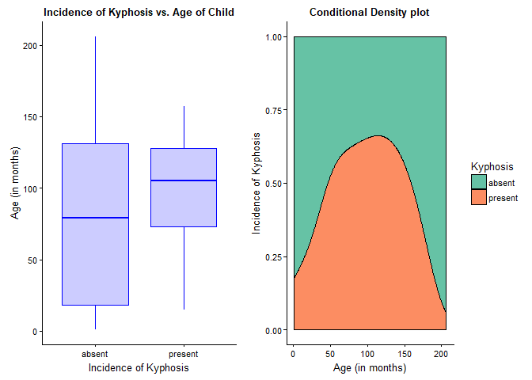
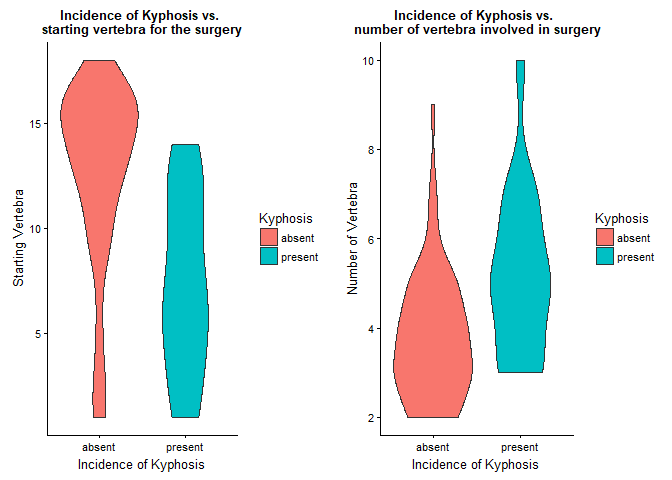
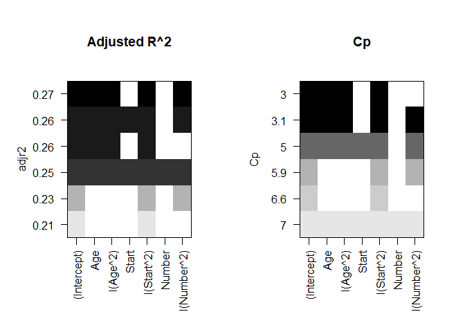
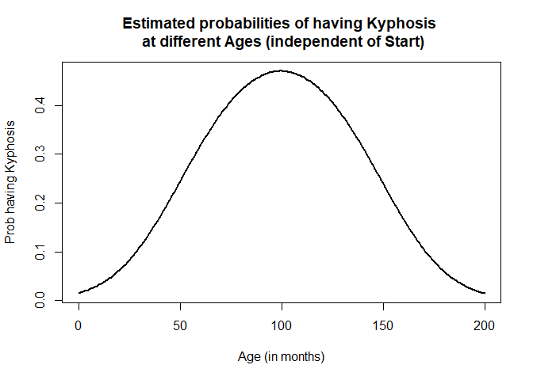
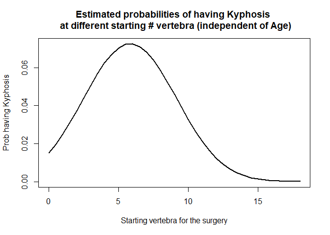

Can GLMs be used to predict illness?
================
Pandula Priyadarshana

About the data
--------------

*Kyphosis* is a spinal deformity found in young children who have corrective spinal surgery. The incidence of spinal deformities following corrective spinal surgery is thought to be related to the *Age* (in months) at the time of surgery, *Start* : the starting vertebra for the surgery and *Number* : the number of vertebra involved in the surgery).

We are interested in finding how each of these factors influence Kyphosis for a particular child and quantify this relationship in a model so that we can predict the probability of a child getting Kyphosis given the information about influencing variables.

EDA on Dataset
--------------

First I import the data in to R and try to get a sense of it.

    ##   Kyphosis Age Number Start
    ## 1   absent  71      3     5
    ## 2   absent 158      3    14
    ## 3  present 128      4     5
    ## 4   absent   2      5     1
    ## 5   absent   1      4    15
    ## 6   absent   1      2    16

    ## 'data.frame':    81 obs. of  4 variables:
    ##  $ Kyphosis: Factor w/ 2 levels "absent","present": 1 1 2 1 1 1 1 1 1 2 ...
    ##  $ Age     : int  71 158 128 2 1 1 61 37 113 59 ...
    ##  $ Number  : int  3 3 4 5 4 2 2 3 2 6 ...
    ##  $ Start   : int  5 14 5 1 15 16 17 16 16 12 ...

As it's seen above, the response variable *Kyphosis* is binary and the predictors are of integer type. Therefore, for modelling, we will have to consider a **GLM** : **logistic regression** model.

Prior moving on to the modeling procedure, I am going to understand how the response variable behave against predictor variables.

### Kyphosis vs. Predictors

Here I plot the response variable against `Age` data.

I am simply using a box-plot and a conditional density plot to illustrate the behavior.

    ## 
    ## Attaching package: 'dplyr'

    ## The following objects are masked from 'package:stats':
    ## 
    ##     filter, lag

    ## The following objects are masked from 'package:base':
    ## 
    ##     intersect, setdiff, setequal, union

    ## 
    ## Attaching package: 'cowplot'

    ## The following object is masked from 'package:ggplot2':
    ## 
    ##     ggsave



By observing the box-plot, it's observable that the age distribution for **Kyphosis : absent** category is more wide spread than of the **Kyphosis : present** incidences. Therefore, it's possible for us to expect to see a difference state of Kyphosis at different ages of children. But then again, since there is an overlap among these two categories (i.e., **Kyphosis:Present** ages are included within the **Kyphosis:Absent** ages) still it's too easy for us to determine whether the `Age` predictor would have a significant influence on the Kyphosis status.

Furthermore, by looking at the **Conditional density plot**, we can see that, age towards the two extremes (i.e., lower-end and higher-end) results with higher **Kyphosis:Absent** incidence whereas the probability of observing a **Kyphosis:Present** incidence is high around the *60 to 140 months* age range (above 50%).

Similarly, we can check `Num` and `Start` variable distributions against `Kyphosis` presence as below:



As we can see, the distribution of `Start` variable does not showcase any significant differences for the two incidences of *Kyphosis* but it's noticable for high *Start* values (appox. above 13), *Kyphosis* is more likely to be *absent*.

With regards to `Number`, there does appead to be different distributions among the *absent* vs *present* Kyphosis incidences, which we can fit a model and further confirm its influence.

Modeling & Model Comparison
---------------------------

As I noted above, since our our response is of binary type, I first fit a `simple logistic regression` model with linear predictors:

``` r
glm_bi_1 <- glm(Kyphosis ~ Age + Start + Number ,
                data = kyphosis, 
                family = binomial(link="logit"))

summary(glm_bi_1)
```

    ## 
    ## Call:
    ## glm(formula = Kyphosis ~ Age + Start + Number, family = binomial(link = "logit"), 
    ##     data = kyphosis)
    ## 
    ## Deviance Residuals: 
    ##     Min       1Q   Median       3Q      Max  
    ## -2.3124  -0.5484  -0.3632  -0.1659   2.1613  
    ## 
    ## Coefficients:
    ##              Estimate Std. Error z value Pr(>|z|)   
    ## (Intercept) -2.036934   1.449575  -1.405  0.15996   
    ## Age          0.010930   0.006446   1.696  0.08996 . 
    ## Start       -0.206510   0.067699  -3.050  0.00229 **
    ## Number       0.410601   0.224861   1.826  0.06785 . 
    ## ---
    ## Signif. codes:  0 '***' 0.001 '**' 0.01 '*' 0.05 '.' 0.1 ' ' 1
    ## 
    ## (Dispersion parameter for binomial family taken to be 1)
    ## 
    ##     Null deviance: 83.234  on 80  degrees of freedom
    ## Residual deviance: 61.380  on 77  degrees of freedom
    ## AIC: 69.38
    ## 
    ## Number of Fisher Scoring iterations: 5

Looking at the summary of the fitted model, we can see that, the `Start` variable is significant at 5% significance level, while both `Start` and `Number` variables are also significant for the model at 10% significance levels.

Now in order to see if there are any complex behaviors/influences among the predictor variables vs. the response, I check it by only fitting the *quadratic* term of the `Age` variable against `Kyphosis` and check if it result with any significance.

    ## 
    ## Call:
    ## glm(formula = Kyphosis ~ Age + I(Age^2), family = binomial(link = "logit"), 
    ##     data = kyphosis)
    ## 
    ## Deviance Residuals: 
    ##     Min       1Q   Median       3Q      Max  
    ## -1.0079  -0.8412  -0.4155  -0.2209   2.3920  
    ## 
    ## Coefficients:
    ##               Estimate Std. Error z value Pr(>|z|)   
    ## (Intercept) -3.7702901  1.1511211  -3.275  0.00106 **
    ## Age          0.0700351  0.0269840   2.595  0.00945 **
    ## I(Age^2)    -0.0003652  0.0001478  -2.471  0.01349 * 
    ## ---
    ## Signif. codes:  0 '***' 0.001 '**' 0.01 '*' 0.05 '.' 0.1 ' ' 1
    ## 
    ## (Dispersion parameter for binomial family taken to be 1)
    ## 
    ##     Null deviance: 83.234  on 80  degrees of freedom
    ## Residual deviance: 72.739  on 78  degrees of freedom
    ## AIC: 78.739
    ## 
    ## Number of Fisher Scoring iterations: 5

Now as it's observed, by including the `quadratic age` term to the model, the model has improved from the privious one while making both the linear and quadratic age terms significant for the model as well.

AIC value for the second model has increased a little when compared with 1st model, but this is with only having `Age` as an input and while making both `Age` and `Age^2` significant at 5% significance level.

Now it's evident that there happens to be complex behaviors among the predictors, therefore, I setup model 3 as the saturate model which considers the *quadratic* variations of these 3 predictor variables.

    ## 
    ## Call:
    ## glm(formula = Kyphosis ~ Age + I(Age^2) + Start + I(Start^2) + 
    ##     Number + I(Number^2), family = binomial(link = "logit"), 
    ##     data = kyphosis)
    ## 
    ## Deviance Residuals: 
    ##      Min        1Q    Median        3Q       Max  
    ## -1.58109  -0.41186  -0.17044  -0.01305   2.36108  
    ## 
    ## Coefficients:
    ##               Estimate Std. Error z value Pr(>|z|)  
    ## (Intercept) -9.0655179  3.6506354  -2.483   0.0130 *
    ## Age          0.0885641  0.0364719   2.428   0.0152 *
    ## I(Age^2)    -0.0004149  0.0001967  -2.109   0.0349 *
    ## Start        0.5312133  0.3458742   1.536   0.1246  
    ## I(Start^2)  -0.0467156  0.0221400  -2.110   0.0349 *
    ## Number       1.5693755  1.0491070   1.496   0.1347  
    ## I(Number^2) -0.1172929  0.0914318  -1.283   0.1995  
    ## ---
    ## Signif. codes:  0 '***' 0.001 '**' 0.01 '*' 0.05 '.' 0.1 ' ' 1
    ## 
    ## (Dispersion parameter for binomial family taken to be 1)
    ## 
    ##     Null deviance: 83.234  on 80  degrees of freedom
    ## Residual deviance: 47.832  on 74  degrees of freedom
    ## AIC: 61.832
    ## 
    ## Number of Fisher Scoring iterations: 7

As we can see from the summary output, not all *quadratic* terms becomes significant for the model.

Therefore, I use the below procedure to check for the **best models** having different number of predictor variables.

    ## Subset selection object
    ## Call: regsubsets.formula(Kyphosis ~ Age + I(Age^2) + Start + I(Start^2) + 
    ##     Number + I(Number^2), data = kyphosis, nbest = 1, method = "exhaustive")
    ## 6 Variables  (and intercept)
    ##             Forced in Forced out
    ## Age             FALSE      FALSE
    ## I(Age^2)        FALSE      FALSE
    ## Start           FALSE      FALSE
    ## I(Start^2)      FALSE      FALSE
    ## Number          FALSE      FALSE
    ## I(Number^2)     FALSE      FALSE
    ## 1 subsets of each size up to 6
    ## Selection Algorithm: exhaustive
    ##          Age I(Age^2) Start I(Start^2) Number I(Number^2)
    ## 1  ( 1 ) " " " "      " "   "*"        " "    " "        
    ## 2  ( 1 ) " " " "      " "   "*"        " "    "*"        
    ## 3  ( 1 ) "*" "*"      " "   "*"        " "    " "        
    ## 4  ( 1 ) "*" "*"      " "   "*"        " "    "*"        
    ## 5  ( 1 ) "*" "*"      "*"   "*"        " "    "*"        
    ## 6  ( 1 ) "*" "*"      "*"   "*"        "*"    "*"



And by looking at the adjusted R^2 (higher) and Cp (lower)values, the best model has both linear and quadratic `Age` terms, and quadratic `Start`term.

Let's fit that model as the best now:

    ## 
    ## Call:
    ## glm(formula = Kyphosis ~ Age + I(Age^2) + Start + I(Start^2), 
    ##     family = binomial(link = "logit"), data = kyphosis)
    ## 
    ## Deviance Residuals: 
    ##      Min        1Q    Median        3Q       Max  
    ## -1.68804  -0.41710  -0.23179  -0.03277   2.19000  
    ## 
    ## Coefficients:
    ##               Estimate Std. Error z value Pr(>|z|)  
    ## (Intercept) -4.1855978  1.7819504  -2.349   0.0188 *
    ## Age          0.0816004  0.0343984   2.372   0.0177 *
    ## I(Age^2)    -0.0004092  0.0001955  -2.093   0.0363 *
    ## Start        0.5619041  0.3215945   1.747   0.0806 .
    ## I(Start^2)  -0.0481986  0.0201136  -2.396   0.0166 *
    ## ---
    ## Signif. codes:  0 '***' 0.001 '**' 0.01 '*' 0.05 '.' 0.1 ' ' 1
    ## 
    ## (Dispersion parameter for binomial family taken to be 1)
    ## 
    ##     Null deviance: 83.234  on 80  degrees of freedom
    ## Residual deviance: 51.298  on 76  degrees of freedom
    ## AIC: 61.298
    ## 
    ## Number of Fisher Scoring iterations: 6

Now, to confirm that there is not significant differences between the saturated model and best model we fit above, lets run a **likelihood ratio** test:

``` r
anova(glm_bi_4,glm_bi_3,test='LR')
```

    ## Analysis of Deviance Table
    ## 
    ## Model 1: Kyphosis ~ Age + I(Age^2) + Start + I(Start^2)
    ## Model 2: Kyphosis ~ Age + I(Age^2) + Start + I(Start^2) + Number + I(Number^2)
    ##   Resid. Df Resid. Dev Df Deviance Pr(>Chi)
    ## 1        76     51.298                     
    ## 2        74     47.832  2   3.4652   0.1768

As you can see on the above output, the result does not contradict our Null hypothesis. Thus we can conclude that, with the use of `glm_bi_4` we can successfully predict **if a child would have Kyphosis or not!**

To see how the **probability of having Kyphosis** change at different **age** values and **start** values, We can plot the following:



Above plots helps us to understand which `Age` and `Start` values we should be cautious about in trying to avoid the possibility of a child getting Kyphosis (i.e., to keep the the probability below 0.5)
